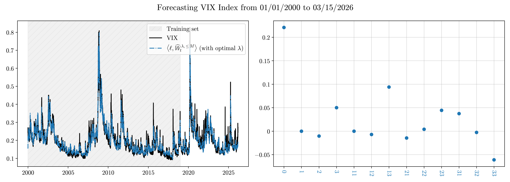
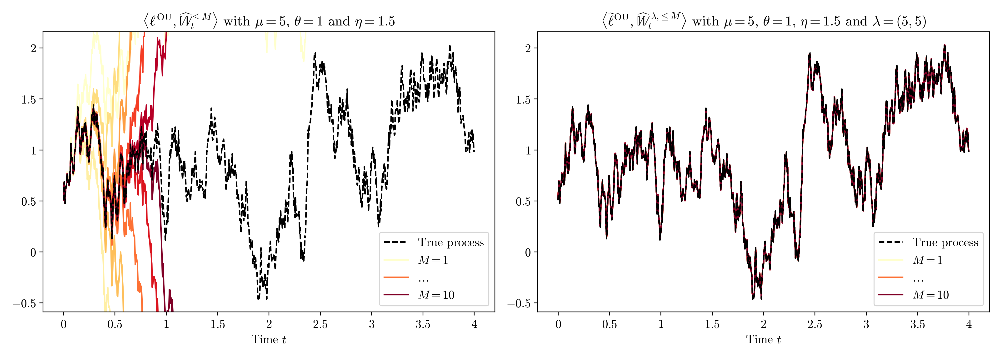
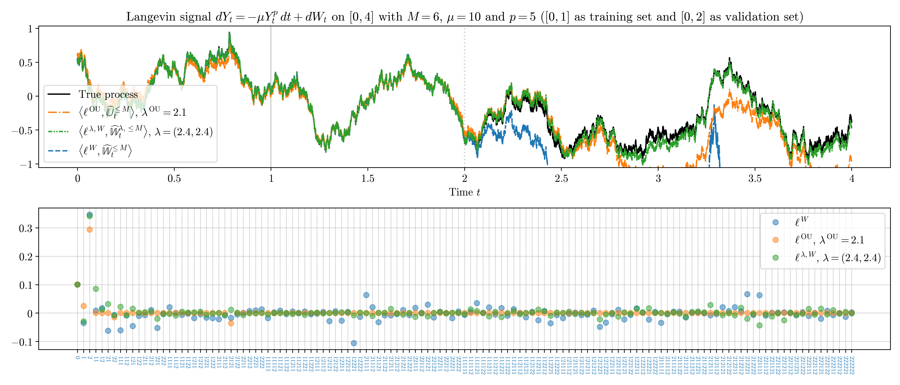
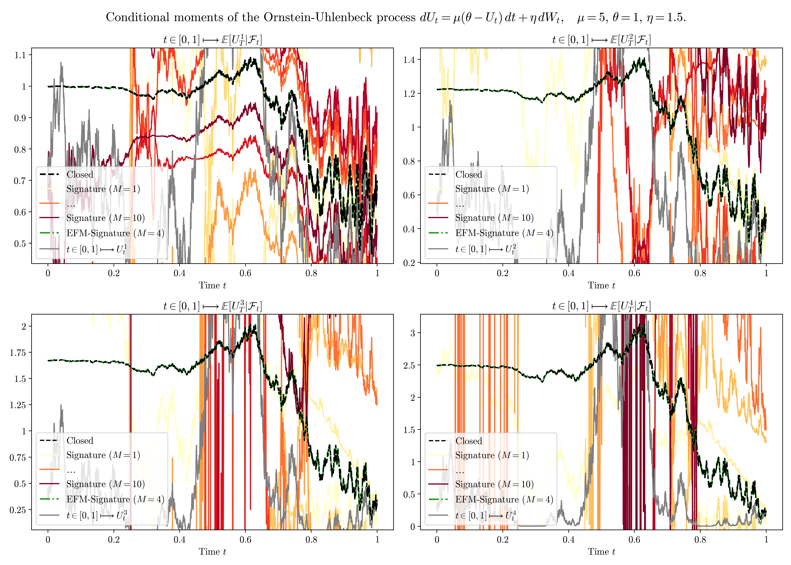
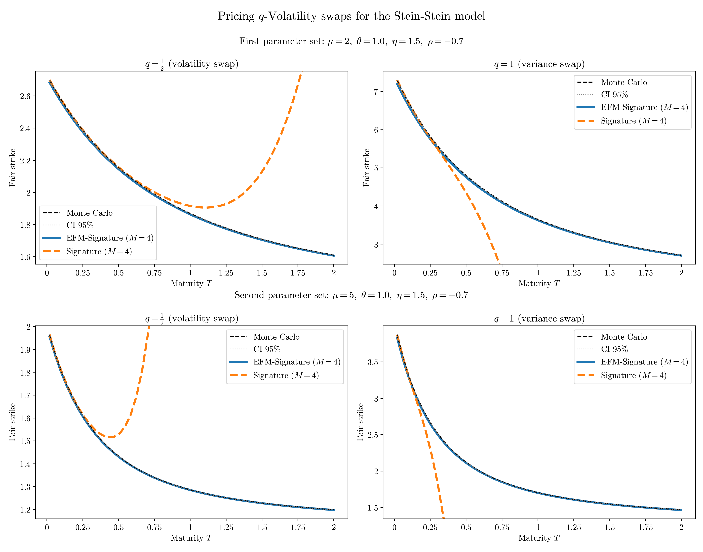

### Exponentially Fading Memory Signature 

This repository reproduces the results of  [Abi Jaber and Sotnikov (2025)](https://arxiv.org/pdf/2507.03700). 

We implement: 
- (see `demo.ipynb`)
- (see `forecasting.ipynb`) 
- computation of conditional moments of Ornstein-Uhlenbeck and CIR processes, multi-factor approximation of completely monotone kernels for the conditional moments of Gaussian Volterra processes $X_t = \int_{-\infty}^t K(t-s)\, dW_s$, for $t\in \mathbb{R}.$ (see `moments_EFM.ipynb`), 
- (see `characteristic_function.ipynb`), 
- introduction of a model in which the instantaneous volatility is given by a linear combination of elements of the EFM-signature of time-augmented Brownian motion, pricing of $q$-Volatility swaps and computation of IV via Fourier inversion (see `fourier_EFM.ipynb`),

### Examples of illustrations 

<!--"""--> 

### Disclaimer 
Source code is available upon request. Please contact me directly. 